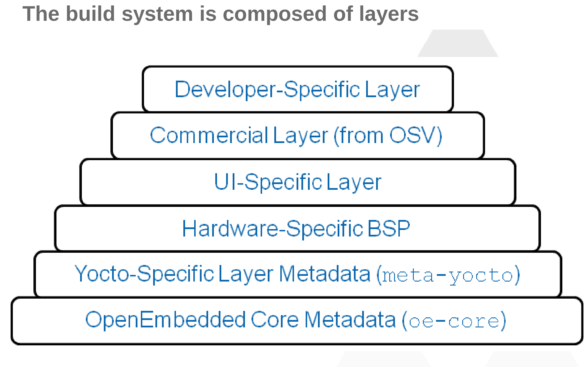

Yocto Project Overview
~~~~~~~~~~~~~~~~~~~~~~

==========================
What is the Yocto Project?
==========================

The Yocto project may be defined as an open source project that
enables developers to quickly build a linux based operating system
for any CPU architecture. Thus, it's popularity for single board
computers (SBC).

It consistents of

	* OE-core
	* Bitbake
	* A number of OE Layers

============================
Where can I find Documention
============================

The core YP documentation can be found

https://docs.yoctoproject.org/

You'll more than likely only use

	* `Variable Glossary`_
	* `QA Checks`_
	* `YP Terms`_ (for familiarity with a few terms)

=============
What is poky?
=============

Poky is a reference distrution that consists of working stable versions

	* OE-core
	* Bitbake
	* A custom reference BSP layer
	* A reference distribution file (``conf/distro/poky.conf``)

It's fine to utilize during testing, but not for a production
ready linux distribution.

=========================
OE (Open Embedded) Layers
=========================

To put it simply

Yocto can be broken up into a series of layers. Each layer contains
BitBake recipes, classes, configs, includes, and sometimes python code
which is used to build wic system image files. All files are used
to generate the final linux distribution. This distro of course runs on
your favorite single board computer (SBC).

Layers generally used in every OE project.

	* `openembedded-core/meta`_ (required)
	* `meta-openembedded/meta-oe`_ (not required)

Image source can be found `intel yocto project and embedded os curriculum`_.

================
What is Bitbake?
================

``bitbake`` is the tool used to parse every layer defined in ``conf/bblayers.conf``
and executes the task/functions defined in recipes contained in each layer.

bitbake source code can be found here

https://git.openembedded.org/bitbake/

.. _Variable Glossary: https://docs.yoctoproject.org/ref-manual/variables.html
.. _QA Checks: https://docs.yoctoproject.org/dev/ref-manual/qa-checks.html
.. _YP Terms: https://docs.yoctoproject.org/ref-manual/terms.html
.. _openembedded-core/meta: https://git.openembedded.org/openembedded-core/tree/meta
.. _meta-openembedded/meta-oe: https://git.openembedded.org/meta-openembedded/tree/meta-oe
.. _intel yocto project and embedded os curriculum: https://www.intel.com/content/dam/www/public/us/en/documents/education/University/yocto-project-and-embedded-os-curriculum.pdf
